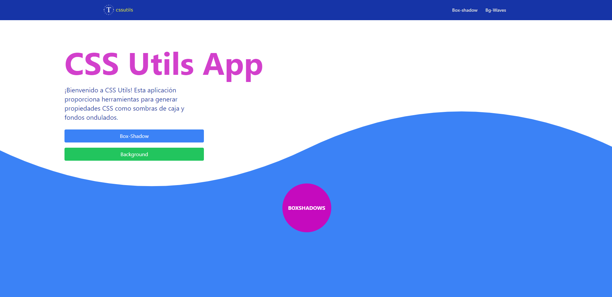
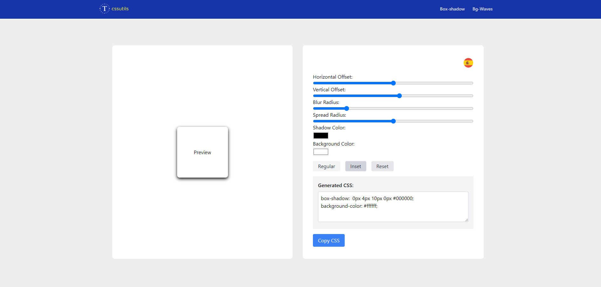
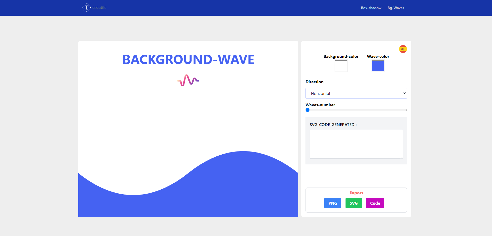
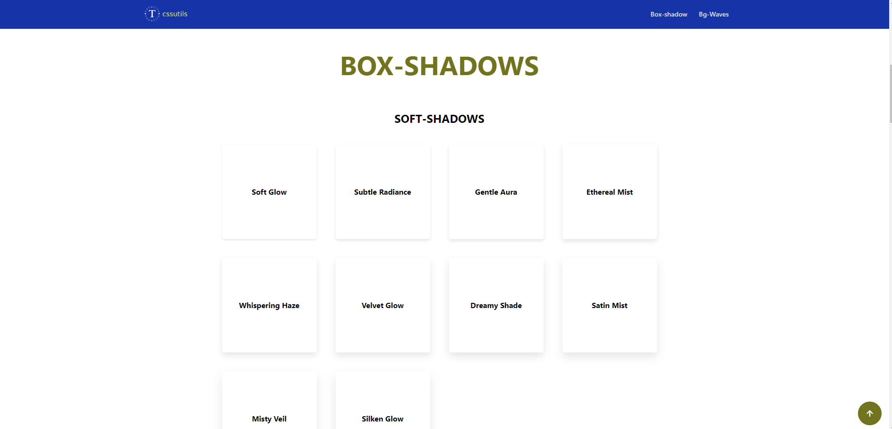
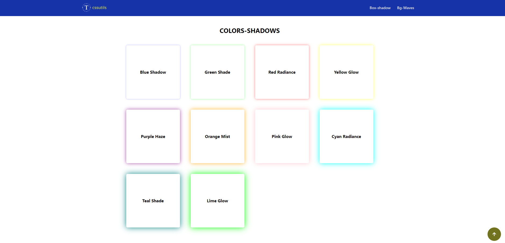

# CSS Utils App

CSS Utils is an application built with React and Tailwind CSS. It provides tools for generating CSS properties such as box shadows and wavy backgrounds.

## How to Use

1. Clone this repository to your local machine.
2. Install dependencies with `npm install`.
3. Run the application with `npm run dev`.
4. Navigate through the different tools using the navigation bar.
5. Customize the properties according to your needs and generate the corresponding CSS code.

## Custom Box Shadows

CSS Utils App offers a variety of pre-designed box shadows that you can easily apply to your elements. Simply click on the Box Shadow Generator tool and choose from the available options.

- **Box Shadow Generator:** Generate custom box shadows using the Box Shadow Generator component.
  

- **Background Generator:** Create adjustable wavy backgrounds with the Background Generator component.
  

## Pre-designed Box Shadows

In addition to custom box shadows, CSS Utils App also provides several pre-designed box shadows that you can select from. These pre-designed shadows offer a quick and convenient way to enhance the visual appeal of your elements.

Enjoy the CSS generation experience with CSS Utils App!
